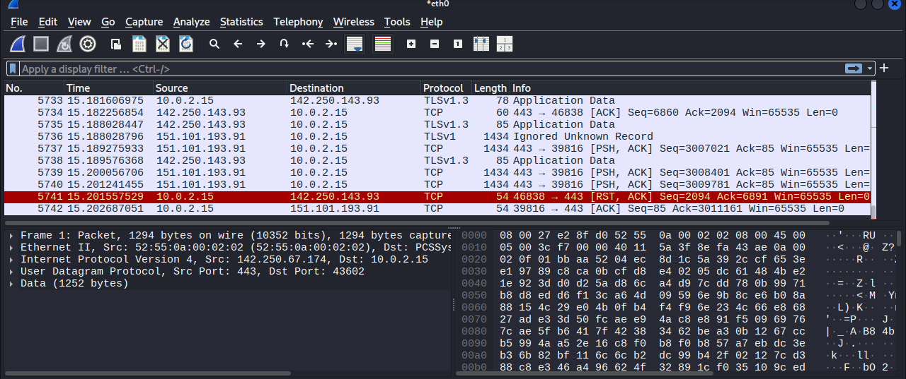

# Wireshark Network Traffic Analysis

## Objective
Analyzed encrypted network traffic using Wireshark on Kali Linux.

## Tools Used
- Kali Linux
- Wireshark
- VirtualBox

## What I Observed
- TLSv1.3 encrypted traffic
- TCP communication over port 443
- ACK and RST packets
- Source and destination IP communication
- Packet flow between local and external systems

## Filters Used

```bash
tcp
tls
dns
ip.addr == 142.250.143.93
```


## Key Learning
Modern web traffic is encrypted, but packet metadata still reveals valuable communication behavior useful in cybersecurity analysis.

## Screenshot
Packet analysis performed using Wireshark on Kali Linux.

